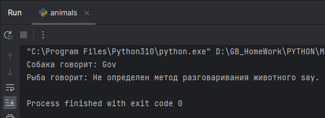
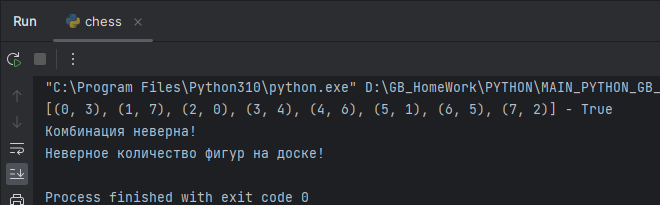

# Погружение в Python. Исключения.

Доработка задач из работы 10. Пользовательские исключения собраны в отдельный пакет **user_ex**.

Возьмите 1-3 задачи из тех, что были на прошлых семинарах или в домашних заданиях.
Напишите к ним классы исключения с выводом подробной информации. Поднимайте исключения
внутри основного кода. Например, нельзя создавать прямоугольник со сторонами отрицательной длины.

Условия по выбросу исключений внесены в соответствующие условия.

# Задача 1
Доработаем задачи 5-6. Создайте класс-фабрику.
Класс принимает тип животного (название одного из созданных классов) и параметры для этого типа.
Внутри класса создайте экземпляр на основе переданного типа и верните его из класса-фабрики.

Пакет **animals** - пакет классов задачи. 

>**Животные, для которых не определена речь и способ перемещения в дочернем классе -
> должны выбрасывать исключение при вызове соответствующих методов.**

**Пример выполнения**

# Задача 2
Возьмите 1-3 любые задачи из прошлых семинаров (например сериализация данных), которые вы уже решали. 
Превратите функции в методы класса, а параметры в свойства. Задачи должны решаться через вызов методов экземпляра.

В качестве основы взята задача о ферзях, методы проверки и расстановки ферзей организованы в классе _ChessGame_. 
Класс в пакете **chess**.

>**Если проверяемая комбинация неверна или количество фигур не соответствует условию - выбрасываем исключение.**

**Пример выполнения**

